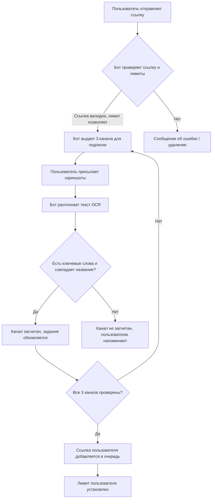

### Описание Telegram Бота для Взаимных Подписок на Каналы

#### 🎯 Краткое описание

Это Telegram-бот, который управляет чатом взаимного пиара. Его основная задача — организовать систему "3 через 3": пользователь может разместить ссылку на свой канал только после того, как подпишется на 3 канала других участников и предоставит скриншоты в качестве доказательства. Бот использует **OCR (Optical Character Recognition)** для автоматической проверки скриншотов.

#### 📊 Ключевой функционал

1.  **Прием и валидация ссылок:**
    *   Пользователь отправляет ссылку на свой канал (например, `@my_channel` или `https://t.me/my_channel`).
    *   Бот проверяет, что ссылка ведет на существующий и доступный канал (`bot.get_chat_member_count`).

2.  **Выдача заданий на подписку:**
    *   Если пользователь не имеет "долгов" и соблюдает лимиты, бот дает ему список из **3 каналов** для подписки.
    *   Список формируется из истории ранее опубликованных ссылок, исключая те, на которые пользователь уже подписывался (данные хранятся в `hist.json`).

3.  **Проверка скриншотов с помощью OCR:**
    *   Это **главная особенность** бота. Вместо ручной проверки бот использует библиотеку `easyocr` для распознавания текста на присланных скриншотах.
    *   Пользователь должен прислать скриншот каждого канала, на который он подписался.
    *   Бот анализирует скриншот, ищет на нем ключевые слова-маркеры успешной подписки (например, "Вы подписались на канал", "You joined this channel", "MUTE", "откл" - индикатор настроек уведомлений).
    *   Алгоритм также сверяет **название канала** на скриншоте с названием из выданного задания, используя сравнение похожих строк (`SequenceMatcher`).

4.  **Учет и лимиты:**
    *   После успешной проверки 3 скриншотов ссылка пользователя добавляется в общую очередь (`Mat.txt`).
    *   На пользователя устанавливается **лимит** (`limit=4`). Это означает, что он сможет опубликовать следующую ссылку только после того, как 3 других пользователя отправят свои ссылки (его лимит уменьшится с 4 до 1).
    *   Весь процесс ограничен по времени (10 минут на выполнение задания).

5.  **Модерация чата:**
    *   Бот автоматически удаляет любые сообщения, не являющиеся ссылками или скриншотами.
    *   Отправляет предупреждения о нарушениях правил.
    *   Есть кнопка **"Правила"**, которая выводит подробную инструкцию.

#### 🛠 Техническая реализация

*   **Язык и библиотеки:** Python, `pyTelegramBotAPI`, `easyocr`, `Pillow (PIL)`, `requests`.
*   **Хранение данных:**
    *   `Mat.txt` — файл с очередью всех опубликованных ссылок.
    *   `hist.json` — JSON-файл, хранящий историю подписок каждого пользователя (`user_id: [list_of_subscribed_channels]`), чтобы не давать ему одни и те же задания повторно.
*   **OCR (Распознавание текста):** Библиотека `easyocr` позволяет распознавать текст на изображениях на русском и английском языках. Это ядро системы проверки.
*   **Алгоритм проверки скриншота:**
    1.  Бот получает файл скриншота от пользователя.
    2.  Загружает изображение и передает его в `easyocr`.
    3.  Получает распознанный текст.
    4.  Ищет в тексте **ключевые фразы**, подтверждающие факт подписки.
    5.  **Сравнивает название канала** на скриншоте с названием из выданного задания. Используется `SequenceMatcher` для неточного сравнения (чтобы учесть возможные ошибки OCR или разные шрифты).
*   **Состояние пользователя:** Управление состоянием (ждет ли бот от пользователя ссылку или скриншоты) реализовано через словари в памяти (`flagdict`, `ldict`, `tdict`, `timed` и т.д.).

#### ⚠️ Важные замечания и особенности

*   **Сложность обмана:** Использование OCR делает бота более устойчивым к мошенничеству по сравнению с системами, где проверка происходит вручную или по факту вступления в канал (что сложнее реализовать в Telegram без прав администратора).
*   **Уязвимости:**
    *   Умный пользователь может подделать скриншот, отредактировав нужный текст поверх изображения канала.
    *   Процесс проверки требует значительных вычислительных ресурсов (распознавание изображений "на лету").
    *   Все состояния хранятся в оперативной памяти. Перезапуск бота обнулит все текущие сессии пользователей.
*   **Нарушение правил:** Как и в случае с VK-ботом, основная цель — автоматизация, нарушающая правила платформы.
*   **Качество распознавания:** Эффективность работы бота напрямую зависит от качества скриншотов и точности работы `easyocr`. Настройка порогов схожести (`ratio() > 0.34`) эмпирическая и может нуждаться в тонкой настройке.

#### 🔄 Логика работы (Упрощенная схема)

---

Этот бот представляет собой интересный пример применения технологий компьютерного зрения (OCR) для модерации и автоматизации процессов в мессенджерах, хотя и с сомнительной с точки зрения правил платформы целью.
